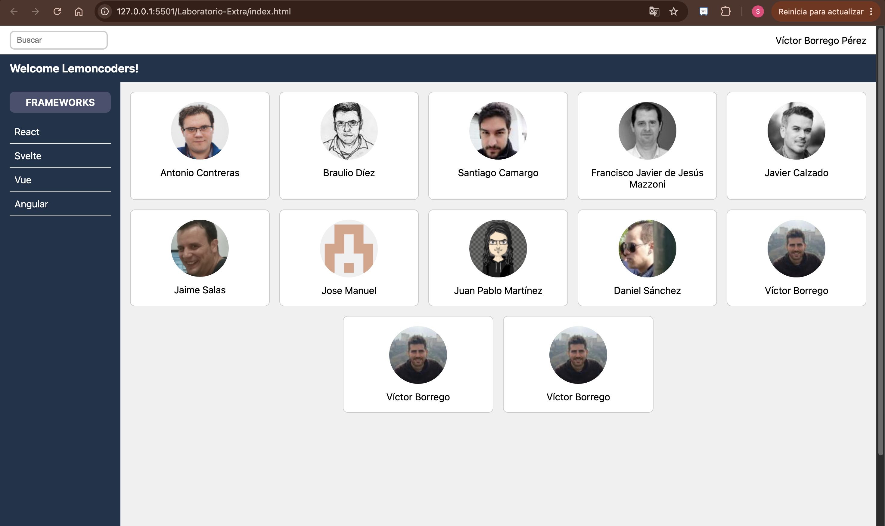

# Laboratorio de Layout
Se ha practicado flex y grid, me quedo con flex jeje

## Laboratorio - Extra
Partida del boilerplate del ejemplo de clase
Estilos css para lograr un layout que se vea bien en todas las resoluciones

## Laboratorio - Avanzado
Partida del boilerplate del ejemplo de clase
Estilos css para lograr una landing tipo streaming

## Cómo verlos
En el navegador o con la extensión de vscode "LiveServer"
